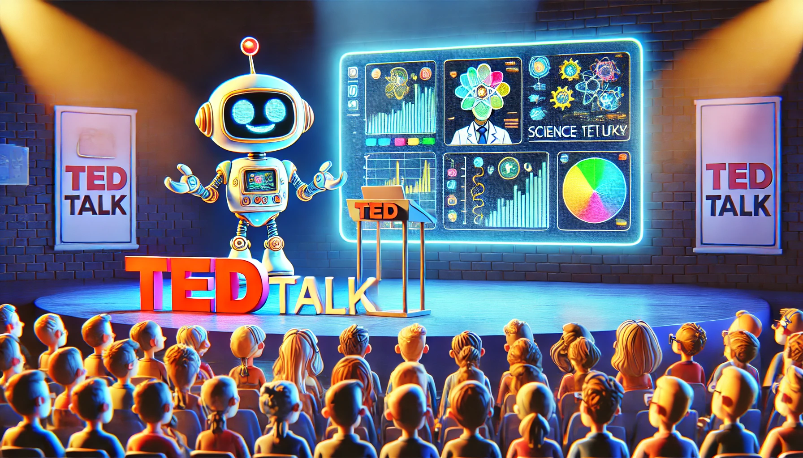
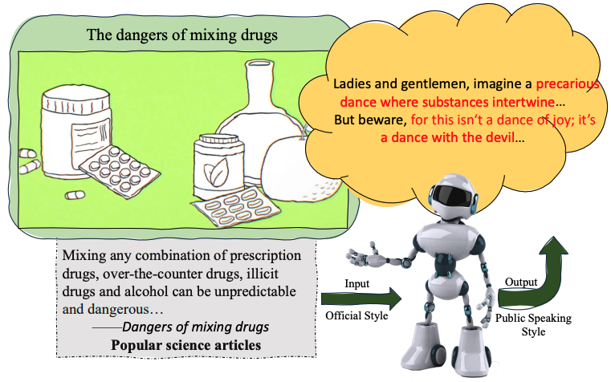
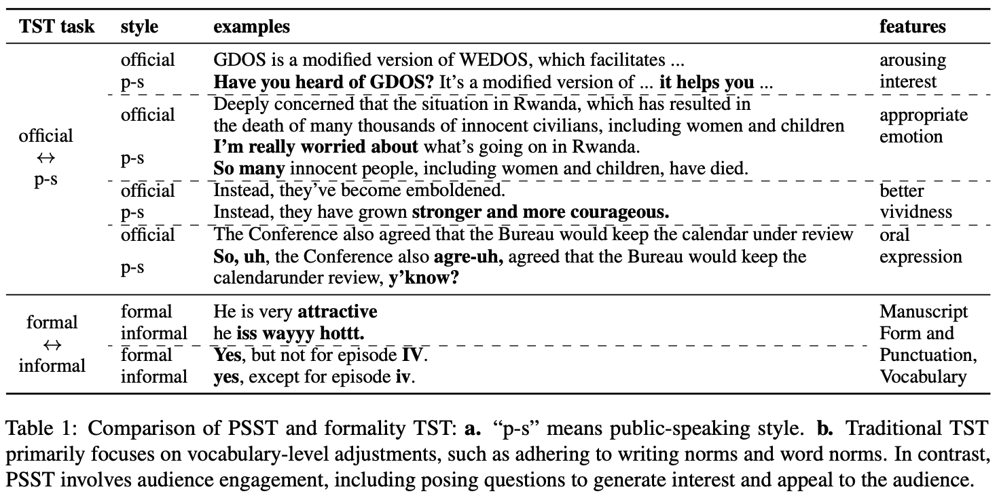
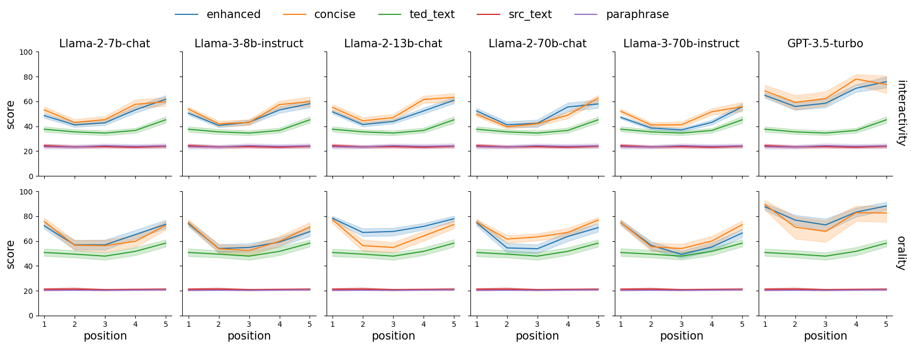
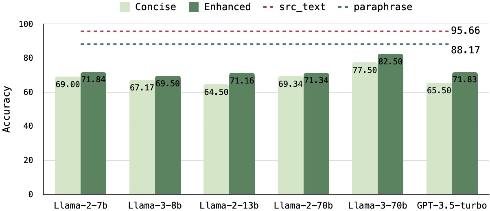
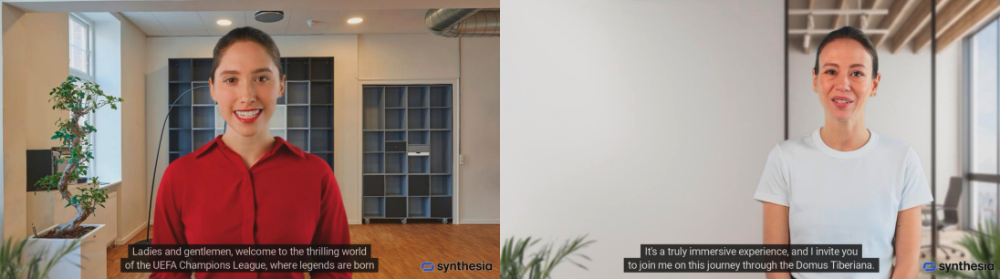

# PSST: A Benchmark for Evaluation-driven Text Public-Speaking Style Transfer

> "*Speech is power: speech is to persuade, to convert, to compel.*"  
> — Ralph Waldo Emerson

<p align="center">        </p>

<p align="center">
  📄 <a href="https://aclanthology.org/2024.findings-emnlp.495.pdf" target="_blank">Paper</a> &nbsp; | &nbsp;
  🎰 <a href="https://huggingface.co/datasets/hot-pot/Test_Data_for_PSST" target="_blank">Datasets</a> &nbsp;| &nbsp;
  👹 <a href="https://huggingface.co/hot-pot/EvalModels_for_PSST" target="_blank">Models</a> &nbsp;
</p>

## Contents
- [PSST: A Benchmark for Evaluation-driven Text Public-Speaking Style Transfer](#psst-a-benchmark-for-evaluation-driven-text-public-speaking-style-transfer)
  - [Contents](#contents)
  - [🥳Introduction](#introduction)
  - [🫵Why Text Public-Speaking Style Transfer?](#why-text-public-speaking-style-transfer)
    - [Motivation](#motivation)
    - [**Public-Speaking Style Transfer(PSST)**](#public-speaking-style-transferpsst)
  - [🧐How To Evaluate your "Speech Draft"?](#how-to-evaluate-your-speech-draft)
    - [Text Style Strength](#text-style-strength)
      - [1.Metrics](#1metrics)
      - [2.Evaluation Results](#2evaluation-results)
    - [Semantic Preservation](#semantic-preservation)
      - [1.QA-Based Method](#1qa-based-method)
      - [2.Evaluation Results](#2evaluation-results-1)
  - [😲Try the speeh draft of your model](#try-the-speeh-draft-of-your-model)
  - [📹Vedio Demo — digital personas](#vedio-demo--digital-personas)
  - [🫣Citation](#citation)

## 🥳Introduction
**Public-Speaking Style Transfer (PSST)**  is an complex, passage-level, scalable, and downstream application-oriented text style transfer task. We started from linguistics and real-world data to analyze the key features of "public speaking style" and proposed fine-grained evaluation metrics for such complex long-text style transfer tasks. Comprehensive experimental results reveal that current LLMs suffer from **over-stylization**, **uneven style strength distribution**, and **severe semantic degradation** problems. We hope that this task can serve as a stepping stone to explore and enhance the language style modeling capabilities of LLMs, promote AI's understanding and imitation of human language, and facilitate the realization of more personalized applications.

## 🫵Why Text Public-Speaking Style Transfer?
### Motivation
- **Background**
  - for research: 
    - the study of style can enhance AI models' ability to comprehend and generate diverse human
languages by modeling complex human attributes such as personality and mindset.
  - for applications: 
    - "style" advances lots of user-centric applications such as role-playing, digital personas and text generation.
- **Problems of traditional text style transfer**
  - Due to the sentence-level, simplistic, and data-driven nature of traditional style transfer tasks, two main problems arise: 
    1. the inability to continuously explore the language style modeling capabilities of LLMs,
    2. the inability to adapt to complex downstream applications.
  - Insufficient Evaluation Methods:
    - Classifier-based style strength evaluation and BertScore(or BLUE)-based semantic evaluation methods cannot provide more detailed evaluation results to help researchers conduct a comprehensive analysis of the language style modeling ability of the model, limiting the advancement of text style transfer technology.
### **Public-Speaking Style Transfer(PSST)**
<p align="center">        </p>

- **Task Definition**: Aims to transform long (0.4k~1.4ktoken), formal texts into a public speaking style, emulating the natural human process of conveying specific knowledge in a public setting.
  - Input: formal text (eg. News, Wiki) + Instruction
  - Output: public speaking style text (eg. Ted speech draft——vivid, interesting)

- **Style Definition**:
  - By analyzing real-world data from a linguistic perspective, we decompose public speaking styles into a set of distinct sub-styles:
    - **Interactivity, Emotionality, Vividness, Orality**
  <p align="center">        </p>

  - **Advantages**:
    - 🤟Evaluation Friendly:  
      - Decomposed substyles are more readily recognizable by both humans and models.
    - 🧩Task Expansion:
      - additional conditions can be introduced to enhance this task such as the speaker’s personality and the audience’s specific preferences.
      - conbine with other tasks (role playing) or modals (audio spoken language model)
    - ✌️Easier Data Construction:
      - The process of constructing substyle data proves markedly less arduous.

## 🧐How To Evaluate your "Speech Draft"?
### Text Style Strength
#### 1.Metrics
We trained a score model at the (multi-) sentence level for each substyle and propose the following two style strength metrics for long texts:
- **Text-Level Style Score**
  - Capture the coarse-grained style strength of the long text.
- **Style Score Distribution**
  - Represent the fine-grained style strength of distinct parts within the text.

#### 2.Evaluation Results
- Excessive Style Strength
  - the transferred texts (blue and orange) exhibit stronger style strength at
the text level in each dimension compared to TEDTalks data (green)
  - Refer to Figure 32 in our paper for the case study.
- Uneven Style Strength Distribution 
  - In real-world scenarios, the style distribution tends to be more uniform, whereas in LLMs, it follows a U-shaped pattern, indicating an overabundance of stylistic elements at the beginning and end of the text. (may realated to [lost in middle](https://aclanthology.org/2024.tacl-1.9/)) 
  - Refer to Figure 21 in our paper for the case study.
<p align="center"> </p>

**Note**  
- Our evaluation models can be found [here](https://huggingface.co/hot-pot/EvalModels_for_PSST).  
- More experiments demonstrating the effectiveness of our method can be found in Section 4.1.3 in our paper.

### Semantic Preservation
For semantic preservation, we propose a QA-based approach, which we believe is better suited to public-speaking real-world scenarios—the style transfer model as a speaker and the QA model as a listener.
#### 1.QA-Based Method
Specifically, for the original text, 10 questions (20 total) are generated from two perspectives: key information and logical relations. The QA model is then tested on both the original and stylized texts. Variations in accuracy reflect the degree of semantic preservation.

#### 2.Evaluation Results
<p align="center"> </p>

- Severe Semantic Degradation
  - Compared to the accuracy of QA based on the original or paraphrased text, the accuracy of QA based on the stylized text decreases significantly, highlighting the significant challenges the style transfer model faces in preserving semantics.
  - Refer to Figure 24 and 25 in our paper for the case study.

**Note**  
- Our evaluation data can be found [here](https://huggingface.co/datasets/hot-pot/Test_Data_for_PSST).  
- The QA-Model used in our experiments are [Llama-3-8B-Instruct](https://huggingface.co/meta-llama/Meta-Llama-3-8B-Instruct)
- More experiments demonstrating the effectiveness of our method can be found in Section 4.2.2 in our paper.

## 😲Try the speeh draft of your model
1. Prepare Data
    - Dowload the [data](https://huggingface.co/datasets/hot-pot/Test_Data_for_PSST) and put it in the `code/oral_exp/raw` folder.

      ```
      code 
      |-- oral_exp
      |   -- raw
      |       --400_delta_100
      |       --800_delta_200
      |       --1200_delta_200
      |-- semantic_preservation
      |-- style_evaluation
      |-- style_score_ditribution
      |-- style_transfer
      ```
2. Run Style Transfer
    - Run the following command to perform style transfer for local models.
      ```
      bash  code/style_transfer/sh/run_local_model.sh
      ```
    - If you want to use APIs to run the style transfer, please set your API_KEY in the `code/style_transfer/openai_access.py` file and run the following command.
      ```
      bash  code/style_transfer/sh/run_api.sh
      ```
    - After running the style transfer, you can find the results in the `code/oral_exp/test_res/${MODEL_NAME}/prediction/` folder.
3. Run Style Evaluation
    - Run the following command to segment passage to sentences.
      ```
      bash /code/style_evaluation/sh_baseline/passage_segmentation_paraphrase.sh
      bash /code/style_evaluation/sh_baseline/passage_segmentation_srctext.sh
      bash /code/style_evaluation/sh_baseline/passage_segmentation_models.sh
      ```
    - Run the following command to score sentence (and chunck).
      ```
      bash /code/style_evaluation/sh_baseline/llama2_score_passage_paraphrase.sh
      bash /code/style_evaluation/sh_baseline/llama2_score_passage_srctext.sh
      bash /code/style_evaluation/sh_baseline/llama2_score_passage.sh
      ```
4. Run Style Score Distribution
``    - Run the following command to evaluate the style score distribution.
      ```
      python /code/style_score_ditribution/prepare_dataset.py
      python /code/style_score_ditribution/plot.py
      ```
5. Run Semantic Preservation
    - Run the following command to evaluate the QA accuracy based on `src_text` and `paraphrased_text`.
      ```
      bash code/semantic_preservation/run_llama3_qa_src_text.sh
      bash code/semantic_preservation/run_llama3_qa_paraphrase.sh

      ```
    - Run the following command to evaluate the QA accuracy based on `transfered_text`.
      ```
      bash code/semantic_preservation/run_llama3_qa_models.sh
      ```
    - You may opt to replace the QA models with alternative ones, akin to attending a presentation delivered by a different individual.
   
## 📹Vedio Demo — digital personas
<p align="center"> </p>

Screenshots of videos based on LLM-generated public speaking style text. All demos are available at
this [URL](https://grateful-sesame-4aa.notion.site/Presentation-of-PSST-de0bcc31121442278a158851aa180fdf)

## 🫣Citation
If you encounter any questions regarding our work, please do not hesitate to submit an issue or contact us directly via email hssun@bit.edu.cn.

If you find our benchmark or evaluation pipeline useful or interesting, please cite our paper.
```
@inproceedings{sun-etal-2024-psst,
    title = "{PSST}: A Benchmark for Evaluation-driven Text Public-Speaking Style Transfer",
    author = "Sun, Huashan  and
      Wu, Yixiao  and
      Yang, Yizhe  and
      Li, Yinghao  and
      Li, Jiawei  and
      Ye, Yuhao  and
      Gao, Yang",
    editor = "Al-Onaizan, Yaser  and
      Bansal, Mohit  and
      Chen, Yun-Nung",
    booktitle = "Findings of the Association for Computational Linguistics: EMNLP 2024",
    month = nov,
    year = "2024",
    address = "Miami, Florida, USA",
    publisher = "Association for Computational Linguistics",
    url = "https://aclanthology.org/2024.findings-emnlp.495",
    pages = "8438--8471",
    abstract = "Language style is necessary for AI systems to accurately understand and generate diverse human language. However, previous text style transfer primarily focused on sentence-level data-driven approaches, limiting exploration of potential problems in large language models (LLMs) and the ability to meet complex application needs. To overcome these limitations, we introduce a novel task called Public-Speaking Style Transfer (PSST), which aims to simulate humans to transform passage-level, official texts into a public-speaking style. Grounded in the analysis of real-world data from a linguistic perspective, we decompose public-speaking style into key sub-styles to pose challenges and quantify the style modeling capability of LLMs. For such intricate text style transfer, we further propose a fine-grained evaluation framework to analyze the characteristics and identify the problems of stylized texts. Comprehensive experiments suggest that current LLMs struggle to generate public speaking texts that align with human preferences, primarily due to excessive stylization and loss of semantic information. We will release our data, code, and model upon acceptance.",
}
```